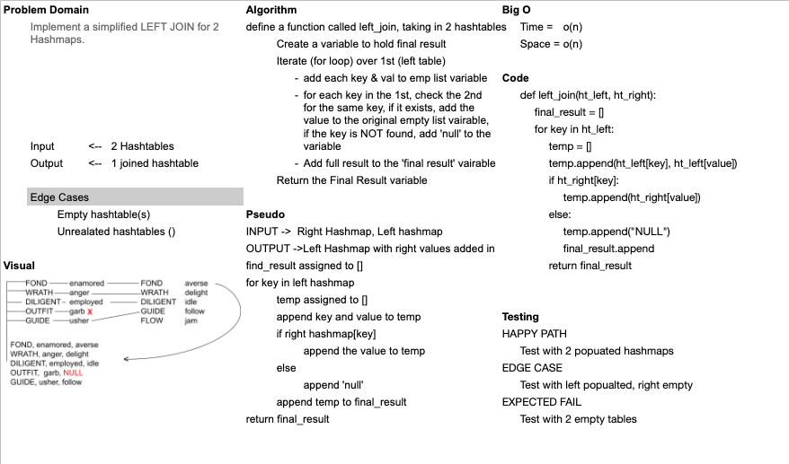

# Hashmap LEFT JOIN
- [Pull Request]()

### Challenge

- Write a function that LEFT JOINs two hashmaps into a single data structure.

### Approach & Efficiency

- I approached the problem by first thinking through the basic problem (zipping 2 lists) & building the function to handle edge cases by looping through one list (left), if it's empty, it will just return an empty list.

### Solution
  

- Did not get through the coding & tests, ran out of room due ot time-boxing
